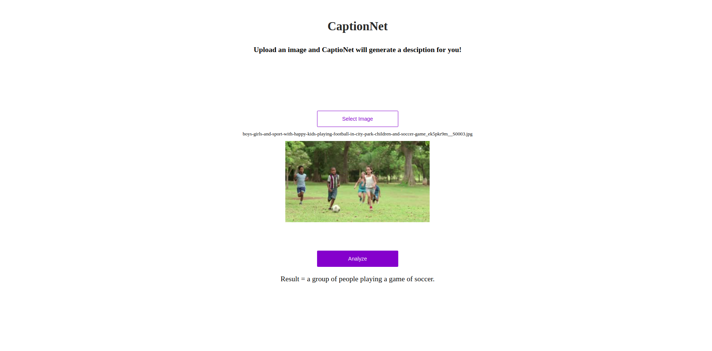

### Setup
Clone the repo and download the following packages for python2.7

### Prerequisites
* **Tensorflow** ([instructions](https://www.tensorflow.org/install/))
* **NumPy** ([instructions](https://scipy.org/install.html))
* **OpenCV** ([instructions](https://pypi.python.org/pypi/opencv-python))
* **Natural Language Toolkit (NLTK)** ([instructions](http://www.nltk.org/install.html))
* **Pandas** ([instructions](https://scipy.org/install.html))
* **Matplotlib** ([instructions](https://scipy.org/install.html))
* **tqdm** ([instructions](https://pypi.python.org/pypi/tqdm))
* **flask**

### Usage
* Download the model from here [here](https://drive.google.com/open?id=1bqyPjwAaos3xeS2p7olGRNFBT6jGfgaQ), rename the file to `model.npy` and place it in app/models/ directory
* cd into app directory and run ```python server.py```
if using linux then use ```sudo python server.py```. This will start the python server, which you can access on `localhost`
* Go to `localhost` in the browser. 
* The app looks like below

